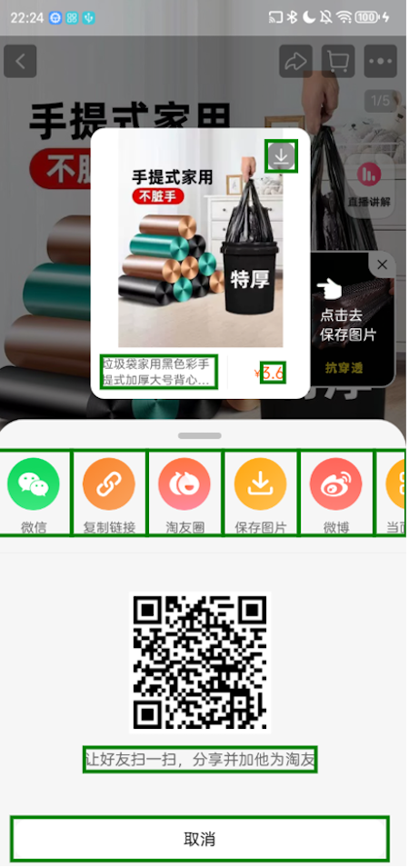
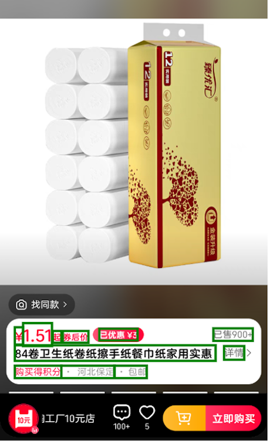
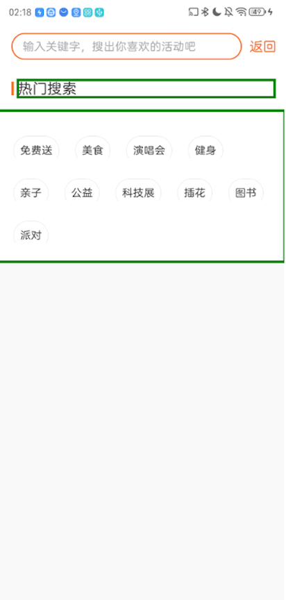

### Participants Overview

| ID   | Gender | Age  | Profession        | Visual Impairment Level |
| ---- | ------ | ---- | ----------------- | ----------------------- |
| 1    | Male   | 35   | Teacher           | Low Vision              |
| 2    | Female | 31   | Teacher           | Low Vision              |
| 3    | Male   | 19   | Student           | Low Vision              |
| 4    | Male   | 19   | Student           | Blind                   |
| 5    | Male   | 20   | Student           | Blind                   |
| 6    | Female | 19   | Student           | Low Vision              |
| 7    | Female | 21   | Student           | Blind                   |
| 8    | Male   | 27   | Software Engineer | Low Vision              |
| 9    | Male   | 28   | Software Engineer | Blind                   |
| 10   | Female | 24   | Software Engineer | Low Vision              |
| 11   | Male   | 46   | Massage Therapist | Blind                   |
| 12   | Female | 40   | Massage Therapist | Blind                   |

------

### Study Design and Interview Framework

Participants were instructed to interact with two distinct focus modes on various app interfaces. Following this interaction, participants were questioned about their comprehension of the page content and their perception of differences between the two focus modes. Specific differences and focus-related issues were explained to them. Subsequently, participants responded to the following questions:

1. Rate the appropriateness of each focus mode.
2. Indicate the frequency of encountering such focus issues during regular usage.
3. Evaluate the impact of these focus issues on usability.
4. Describe their ideal expectations for resolving such issues.
5. Provide additional thoughts or suggestions related to these focus issues.

#### Page Types and Observations

1. **Case 1: NA**
    - **App**: E-commerce (Taobao)
    - **Content**: A product-sharing page for garbage bags.
    - **Issue**: The TalkBack mode skipped focus on certain buttons, such as "Share to Weibo" and "Share to WeChat."

| TalkBack | Manual Label     |
| ----- | ------------------- |
|      |         |

2. **Case 2: OA**
    - **App**: Real estate (Beike)
    - **Content**: Filtering properties based on options.
    - **Issue**: In TalkBack mode, some regions appeared blank to sighted users, with the screen reader announcing only "Column X."

| TalkBack | Manual Label     |
| ----- | ------------------- |
|      |         |

3. **Case 3: SA(Group)**
    - **App**: E-commerce (Tmall)
    - **Content**: Displaying product information for tissues.
    - **Issue**: In TalkBack mode, individual components of the product information were focused separately, whereas the manual annotation mode combined them into a single focal point.

| TalkBack | Manual Label     |
| ----- | ------------------- |
|      |         |

4. **Case 4: SA(Individual)**
    - **App**: Life (HuodongJu)
    - **Content**: Searching for keywords with recommended popular search terms.
    - **Issue**: In TalkBack mode, all popular search terms were grouped into one focal point, while the manual annotation mode allowed each search term to be focused individually.

| TalkBack | Manual Label     |
| ----- | ------------------- |
|      |         |

------

### Evaluation Metrics

#### Frequency of Encountering Focus Issues

| Score | Frequency Level     |
| ----- | ------------------- |
| 0     | Not Frequent        |
| 1     | Less Frequent       |
| 2     | Moderate            |
| 3     | Relatively Frequent |
| 4     | Frequent            |
| 5     | Very Frequent       |

#### Severity of Focus Issues

| Score | Severity Level    |
| ----- | ----------------- |
| 0     | Not Severe        |
| 1     | Mildly Severe     |
| 2     | Moderate          |
| 3     | Relatively Severe |
| 4     | Severe            |
| 5     | Very Severe       |

#### Satisfaction with Focus Mode

| Score | Satisfaction Level |
| ----- | ------------------ |
| 0     | Very Unsatisfied   |
| 1     | Unsatisfied        |
| 2     | Neutral            |
| 3     | Somewhat Satisfied |
| 4     | Satisfied          |
| 5     | Very Satisfied     |
